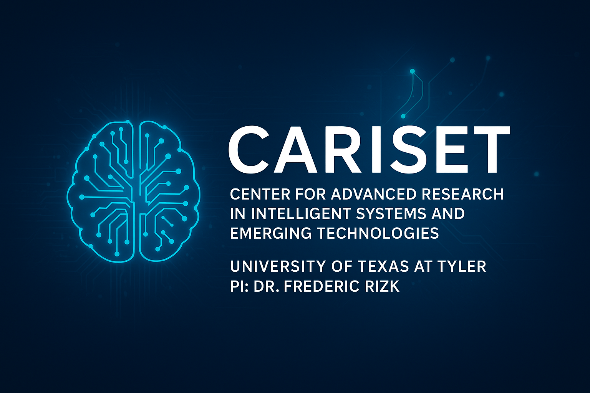

# CARISET  
**Center for Advanced Research in Intelligent Systems and Emerging Technologies**

---

## About Us  

CARISET is a research center dedicated to advancing the frontiers of **intelligent systems** and **emerging technologies**.  
We bring together faculty, students, and collaborators to explore groundbreaking solutions that address real-world challenges.

Our mission is to:  
- Drive impactful research in **AI, Machine Learning, Distributed Systems, Quantum Computing, and Cybersecurity**.  
- Foster **collaborations** across academia, industry, and government.  
- Train the **next generation of scientists and engineers** in cutting-edge technologies.

---

## Research Areas  

- Artificial Intelligence & Machine Learning  
- Cybersecurity & Privacy  
- Distributed & Cloud Computing  
- Quantum Computing & AI Integration  
- Intelligent Systems for Healthcare and Education  

---

We also mentor graduate and undergraduate students through **research projects, thesis supervision, and industry collaborations**.

---

## Leadership  

CARISET is led by **Dr. Frederic Rizk**, Assistant Professor of Computer Science and Engineering.  
Dr. Rizk’s research focuses on **AI, distributed systems, quantum computing, and security**, with a passion for building innovative frameworks that push the boundaries of intelligent technologies.

---

## Contact Us  

Email: [frizk@uttyler.edu](mailto:frizk@uttyler.edu)

